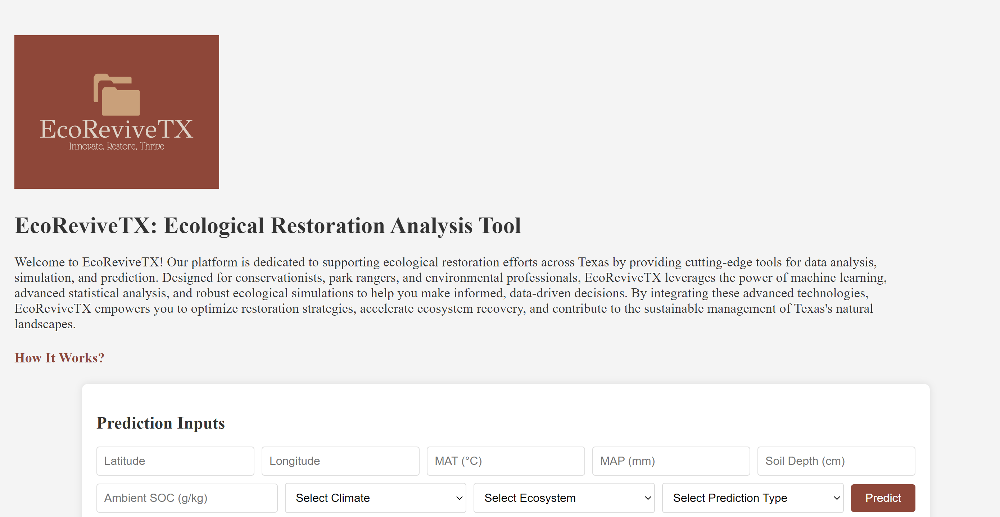

# EcoReviveTX

## Overview

**EcoReviveTX** is an advanced full-stack web application designed to support ecological restoration efforts in Texas. It leverages machine learning, statistical analysis, and C-based simulations to provide actionable insights for conservationists, park rangers, and environmental professionals. The platform offers tools for predicting restoration timelines and soil health metrics, as well as for simulating various environmental scenarios. By integrating these technologies, EcoReviveTX aids in optimizing restoration strategies, accelerating ecosystem recovery, and managing Texas's natural landscapes more sustainably.

Explore the website [here](https://ecorevivetx.onrender.com/)

## Technologies Used

* **Front-End:** JavasScript (jQuery), HTML, CSS
* **Back-End:** Flask (Python), RESTful API
* **Machine Learning:** Python
* **Ecosystem Modeling:** C
* **Data Visualization:** MATLAB
* **Deployment:** Render

## Features & Project Highlights

* **Prediction Tool:** Utilizes machine learning models to predict restoration timelines and soil health metrics based on inputs like latitude, longitude, mean annual temperature (MAT), mean annual precipitation (MAP), soil depth, and ambient soil organic carbon (SOC). This tool allows users to make data-driven decisions for planning and adjusting restoration strategies.
* **Simulation Tool:** Provides C-based simulations to forecast restoration outcomes. Users can input environmental factors such as MAT, MAP, soil depth, climate type, and ecosystem type to run simulations. The tool includes both basic and Monte Carlo simulations to evaluate different scenarios.
* **MATLAB-Driven Data Visualizations:** Offers clear insights into critical environmental variables, helping users monitor progress and identify trends in ecological restoration projects. The visualizations are based on data refined and reanalyzed from a study originally focused on China, adapted for Texas ecosystems.
* **Interactive Forms:** The platform features user-friendly forms for both predictions and simulations. These forms allow users to input relevant data and receive immediate feedback on their restoration projects.
* **Dynamic Content:**  AJAX for real-time updates and interactions within the platform. Includes a modal with detailed instructions on how to use the platform, enhancing user experience by providing context-specific guidance.

